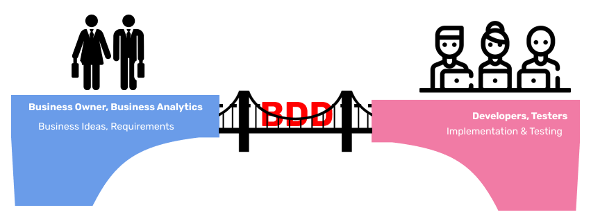
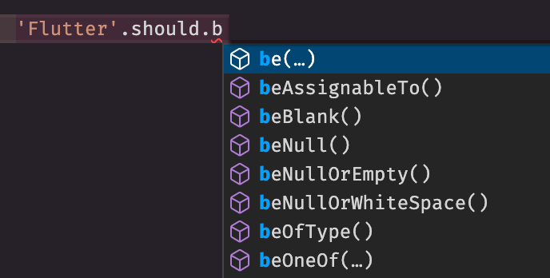
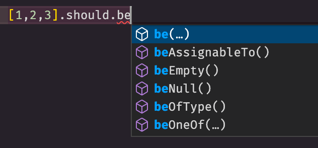

# Readable Unit Tests in Dart/Flutter

In this article, I will show you how to write more readable and expressive unit tests. And, maybe, you feel like a writer of an interesting poem, not a boring and tedious code.

I won't go into too much detail on TDD and BDD. I assume that you are already familiar with or at least heard what these techniques are. If not, then please take a look at the [TDD video lesson here](https://www.youtube.com/watch?v=FWra0ORVios) and about the [BDD video lesson here](https://www.youtube.com/watch?v=FWra0ORVios).

<div style="width:100%;height:0;padding-bottom:100%;position:relative;"><iframe src="https://giphy.com/embed/4V3ubwnm24g0ud2V17" width="100%" height="100%" style="position:absolute" frameBorder="0" class="giphy-embed" allowFullScreen></iframe></div>

## What is BDD?

**BDD** or **Behaviour Driven Development** it is an technique in application development when development is drive (or dictated) by the **behavior** of the application.

**BDD** - is an extension for **TDD**.

**TDD** (**Test-driven development**) means *"writing tests before implementation"*. And **BDD** is added that tests (or scenarios) should describe *"behavior of the system"*, in our case in unit tests, the behavior of an unit (class or function).

## Why use BDD?



Every company has at least two teams. The first is the business team (Business Owners, analysts, and others who are not technical specialists), and the second is the development (and maybe testers) team. And in order to bridge the gap between them in understanding - "The business team understands what the development team is doing", and "the development team clearly understands what the business requires" they need a "common" language that is understandable for all parts of the team, even non-programmers and at the same time structured enough for automation.

So they use **BDD** and its scenarios.

## BDD style

What do I mean by **more readable** tests?

This is the **BDD style** of scenarios (or tests).

For example, below is the scenario for `PNL Calculator`:

```text
Given 1000 coins with a total investment of $1000
When coin price raise up to $2
Then PNL % should be 100%
  And PNL value should be $1000
  And holding value should be $2000
```

BDD scenarios (tests) are written according to the following pattern **GIVEN-WHEN-THEN**:

- **GIVEN** - initial state or input parameters, i.e., we had 1000 coins and spent \$1,000 to buy them, or the price of one coin was \$1;
- **WHEN** - the action we are testing, i.e., the price of the coin has doubled, and the calculator should calculate the new PNL values ​​for us;
- **THEN** - output parameters or final state, i.e., new values, we have profit, loss, or nothing has changed.

## Three parts of unit tests

Next, we need to highlight three parts related to unit tests. They are:

- the code of the tests themselves;
- report on success or failure;
- error message in case of a failed test.

Each of these parts is very important:

- If the **test code** is written earlier, then in a couple of weeks, it will be easier to understand the code for you, or a new developer will quickly understand what the test is about, or even a tester will be able to write a unit test himself.
- **Report** - can be a "living documentation" that describes how the program works and can be read by any team member, even a non-technical person.
- If the **error message** clearly explains the cause of the error, and understands the context, then fixing the test will be faster.

We will improve each of these parts now.

## PNL Calculator

Using the `PNL Calculator` as an example, we will describe its behavior in unit tests.

Imagine that we need to write tests for three cases:

- when the price of the coin has risen - profit;
- when the price of the coin has decreased - loss;
- when the price of the coin has not changed.

BDD scenario for profit case:

```text
Given 1000 coins with a total investment of $1000
When coin price raise up to $2
Then PNL % should be 100%
  And PNL value should be $1000
  And holding value should be $2000
```

A unit test might look like this:

```dart
group('Given 1000 coins with a total investment of \$1000 ', () {
  const coinAmount = 1000.0;
  const totalInvestment = 1000.0;

  group('\nWhen coin price raise up to \$2', () {
    late PnlCalculatorResult pnl;
    setUp(() {
      pnl = PnlCalculator.calculate(
        coinAmount: coinAmount,
        totalInvestments: totalInvestment,
        currentPrice: 2,
      );
    });
    test('\nThen PNL % should be 100%', () {
      expect(pnl.percent, 100);
    });

    test('\n    And PNL value should be \$1000', () {
      expect(pnl.value, 1000);
    });

    test('\n    And holding value should be \$2000', () {
      expect(pnl.holdingValue, 2000);
    });
  });
});
```

And in the output we would get something like this:

```bash
✓ Given 1000 coins with a total investment of $1000  
When coin price raise up to $2 
Then PNL % should be 100%
✓ Given 1000 coins with a total investment of $1000  
When coin price raise up to $2 
    And PNL value should be $1000
✓ Given 1000 coins with a total investment of $1000  
When coin price raise up to $2 
    And holding value should be $2000
```

What are the problems with this test and report?

- Test code is hard to read. There are `group,` `setUp,` and `test` terms that are technically specialized and make it difficult to read what the test is about. And BDD involves using simpler terms and formulations that any team member, even a person far from programming, will be able to read the test and understand what it is about.
- If you look at the report, we will notice the duplication of the `GIVEN` and `WHEN` blocks, and now it is not easy to merge the `THEN` and `AND` blocks so that the report looks exactly like the script itself. And `\n` with a tab in the test description also spoils the test's code.

And here the first Dart package [given_when_then_unit_test](https://pub.dev/packages/given_when_then_unit_test) comes to our aid. Which helps us to write test as follows:

```dart
given('1000 coins with a total investment of \$1000', () {
  const coinAmount = 1000.0;
  const totalInvestment = 1000.0;

  when('coin price raise up to \$2', () {
    late PnlCalculatorResult pnl;
    before(() {
      pnl = PnlCalculator.calculate(
        coinAmount: coinAmount,
        totalInvestments: totalInvestment,
        currentPrice: 2,
      );
    });

    then('PNL % should be 100%', () => expect(pnl.percent, 100), and: {
      'PNL value should be \$1000': () => expect(pnl.value, 1000),
      'holding value should be \$2000': () => expect(pnl.holdingValue, 2000),
    });
  });
});
```

And the report will completely copy the scenario text, and the test code itself ~~exactly~~ almost copies the script text.

```bash
Given 1000 coins with a total investment of $1000 
When coin price raise up to $2 
Then PNL % should be 100%
  And PNL value should be $1000
  And holding value should be $2000
```

<iframe src="https://giphy.com/embed/3XR0chfiSTtAI" width="480" height="365" frameBorder="0" class="giphy-embed" allowFullScreen></iframe>

## Shouldly

> and the test code itself ~~exactly~~ almost copies the script text.

...except for these assertion lines:

```dart
then('PNL % should be 100%', () => expect(pnl.percent, 100), and: {
  'PNL value should be \$1000': () => expect(pnl.value, 1000),
  'holding value should be \$2000': () => expect(pnl.holdingValue, 2000),
});
```

But we will fix this now with the second Dart package [shouldly](https://pub.dev/packages/shouldly), which will allow you to write more expressively, after which the assertions will be read more naturally, like a typical English sentence.

And these assertions would be written as follows:

```dart
expect(pnl.percent, 100)       => pnl.percent.should.be(100)
expect(pnl.value, 1000)        => pnl.value.should.be(1000)
expect(pnl.holdingValue, 2000) => pnl.holdingValue.should.be(2000)
```

And in this way, the test code completely copies the text of the script:

```dart
then(
  'PNL % should be 100%', () => pnl.percent.should.be(100),
  and: {
    'PNL value should be \$1000': () => pnl.value.should.be(1000),
    'holding value should be \$2000': () => pnl.holdingValue.should.be(2000),
  },
);
```

### More Features

There are several reasons why you should use `shouldly`. 

#### Contextual fail messages

Let's imagine that we check for equality of two numerical values ​​and, in the case when they are not equal; we get the following report for the failure of the test:

```bash
Expected: <10>
  Actual: <100>
```

Who can say what those 100 and 10 are? What are these variables, and what is specifically compared there? We do not have such information. Only if we look in the logs and find a test description we could understand.

But if you imagine that there are two assertions in one test, what should not be done and what I talk about in [this video](https://www.youtube.com/watch?v=FWra0ORVios&t=1632s)

```dart
test('many expectations in single test', () {
  expect(hero.health, 100);
  expect(hero.strength, 100);
});
```

How do you know which statement is false? Well, you can again dig in the logs and find a line. Or add `reason` to `expect`.

```dart
expect(hero.health, 100, reason: 'Health in the beginning should be 100');
expect(hero.strength, 100);
```

After that, if the test fails, we will have a context why it happened. But the error message doesn't look natural.

```bash
Expected: <100>
  Actual: <10>
Health in the beginning should be 100
```

With `shouldly`, the same erroneous assertion would be written like this:

```dart
hero.health.should.be(100);
```

The test failure message will look like this:

```bash
Expected `int`
    should be
100
    but was
10
```

And if we specify the name of the variable through `.as('some alias').`:

```dart
hero.health.should.as('hero health').be(100);
```

then we will get a more pleasant and understandable message about the reason for the test failure:

```bash
Expected `hero health`
    should be
100
    but was
10
```

Unfortunately, a typing in Dart doesn't work like it does in .NET. In .NET, we can get information about a variable and its properties, and we wouldn't have to use `.as('some alias').`, for example, as shown [here](https://docs.shouldly.io/documentation/equality/shouldbe). Who knows, maybe this feature will be in the future releases of Dart.

#### Confusion actual with expected

The `expect` method takes two parameters, one is `matcher` (or `expected`) and the other is `actual`. Could you tell me, which one is the first parameter of the `expect` function, and which one is the second one?

```dart
final actual = 0;
final expected = 0;

expect(actual, expected);
expect(expected, actual);
```

Both recorded assertions will pass.

Let's now try to specify the `isZero` matcher.

```dart
final actual = 0;

expect(actual, isZero);
expect(isZero, actual);
```

Before running the test, everything seemed to be okay - there were no compilation errors.

BUT! The second statement will fail and will produce a bizarre error.

```bash
Expected: <0>
  Actual: a value equal to <0>
```

<div style="width:100%;height:0;padding-bottom:68%;position:relative;"><iframe src="https://giphy.com/embed/l2QE1bH4wvCE8CcTK" width="100%" height="100%" style="position:absolute" frameBorder="0" class="giphy-embed" allowFullScreen></iframe></div>

#### The assertions heap

`shouldly` does not lump everything together, all expect helpers or matchers.

For example, you can't test a numeric type against an empty string, as you can with `expect`:

```dart
 expect(0, isEmpty);
```

In `shouldy` everything is relative to the type of the result we need to check.

<div>





</div>

ℹ️ More features here:

- [Custom matchers](https://pub.dev/packages/shouldly#custom-matchers),
- [Conjunctions](https://pub.dev/packages/shouldly#conjunctions),
- [SatisfyAllConditions](https://pub.dev/packages/shouldly#satisfyallconditions) 
- and others can be found on the page [of the library itself on pub.dev](https://pub.dev/packages/shouldly).

## Test Cases

Ideally, you need to test many cases (**test cases**). And at the writing of each case separately, there will be a problem of duplication of the code. The `testCases` methods come to the rescue, which allows you to *parameterize* the test.

This method has two parameters, the first is an array of `TestCase` objects that specifies the input and output values, and the second parameter is a function called on each test case.

In our example with the PnL calculator, we will test two more test cases: one for loss and the other for the case when there is no change in the coin price.

Here's what the test with cases would look like:

```dart
given('1000 coins and with a total investment of \$1000', () {
  final coinAmount = 1000.0;
  final totalInvestment = 1000.0;

  testCases4<double, double, double, double>([
    TestCase4(2, 100, 1000, 2000),
    TestCase4(.1, -90, -900, 100),
    TestCase4(1, 0, 0, 1000),
    // ...more Test Cases
  ], (testCase) {
    when('the coin price became \$${testCase.arg1}', () {
      late PnlCalculatorResult pnl;
      before(() {
        pnl = PnlCalculator.calculate(
          coinAmount: coinAmount,
          totalInvestments: totalInvestment,
          currentPrice: testCase.arg1,
        );
      });

      then(
        'PNL % should be ${testCase.arg2}%',
        () => pnl.percent.should.be(testCase.arg2),
        and: {
          'PNL value should be \$${testCase.arg3}': () =>
              pnl.value.should.be(testCase.arg3),
          'holding value should be \$${testCase.arg4}': () =>
              pnl.holdingValue.should.be(testCase.arg4),
        },
      );
    });
  });
});
```

<iframe src="https://giphy.com/embed/XreQmk7ETCak0" width="480" height="360" frameBorder="0" class="giphy-embed" allowFullScreen></iframe>

## Conclusion

So with two packages [given_when_then_unit_test](https://pub.dev/packages/given_when_then_unit_test) and [shouldly](https://pub.dev/packages/shouldly) we can improve:

1) readability of test code,
2) test reports,
3) and get a more detailed reason for the error, when the test fails.


It's useful to note,

The above BDD style technique does not always need to be used in unit testing. But where it is possible, where you can describe the *behavior* of a unit, you can safely take and describe "live documentation".
Each of these libraries can be used separately, but together they give a stunning result.

Good luck with your beautiful writing! 🚀

## Contribution

Feel free to contribute these packages 🙏
