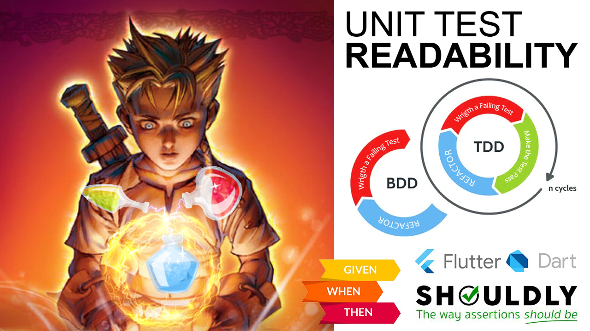
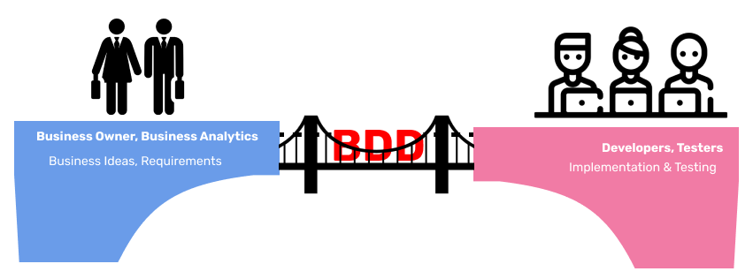
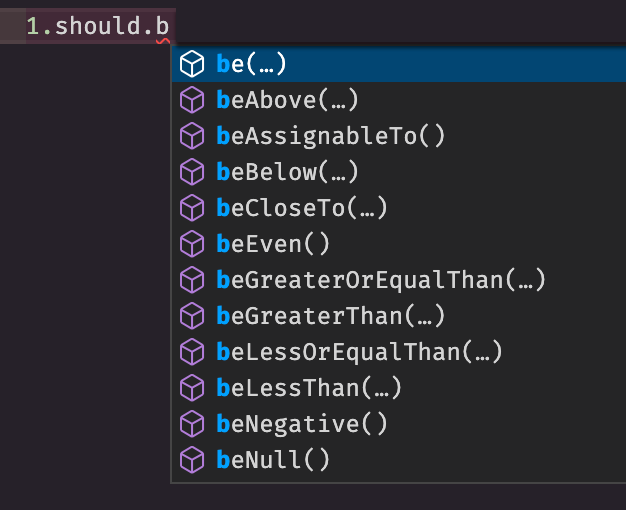
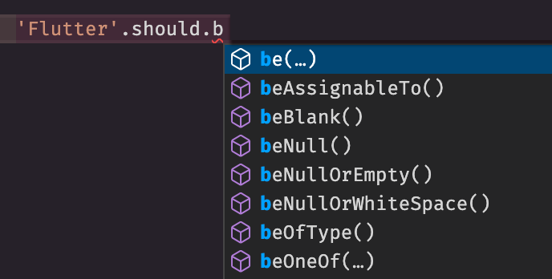
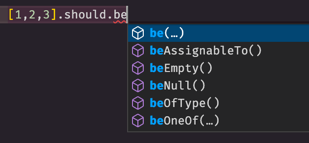
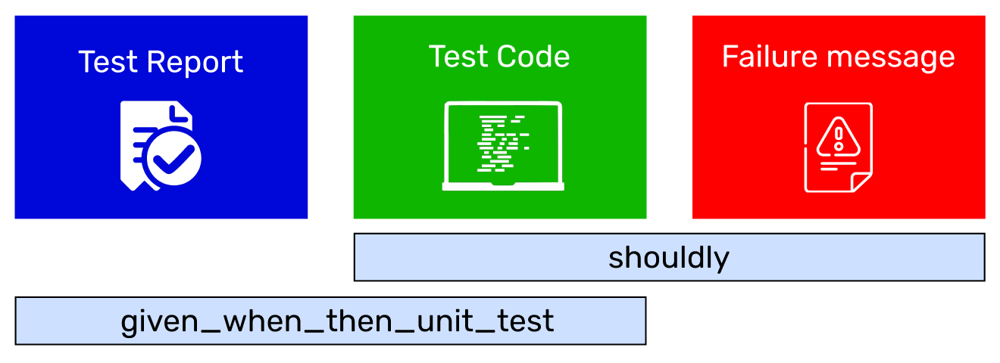

# Readable Unit Tests in Dart/Flutter

В этой статье я покажу, как писать более читабельные и выразительные юнит-тесты. И почувствовать себя писателем красивого произведения, а не скучного, тяжело понятного кода.

Я не буду слишком вдаваться в подробности TDD и BDD. Я предполагаю, что вы уже знакомы или как минимум слышали, что это за техники. Если нет, то пожалуйста, посмотрите [видео-урок по TDD тут](https://www.youtube.com/watch?v=FWra0ORVios) и про [BDD вот тут](https://www.youtube.com/watch?v=FWra0ORVios).

<div style="width:100%;height:0;padding-bottom:100%;position:relative;"><iframe src="https://giphy.com/embed/4V3ubwnm24g0ud2V17" width="100%" height="100%" style="position:absolute" frameBorder="0" class="giphy-embed" allowFullScreen></iframe></div>

## Что такое BDD?

**BDD** или **Behaviour Driven Development** - это подход в разработке приложения, когда разработка диктуется **поведениями** этого приложения.

**BDD** - это расширение над **TDD**.

**TDD** (**Test-driven development**) подразумевает *"написание тестов перед реализацией"*. А **BDD** добавляет, что тесты (или сценарии) должны описывать *"поведение системы"*, в нашем случае в юнит-тестах поведение юнита (класса или функции).

## Зачем BDD?



В каждой компании есть как минимум две команды. Первая - бизнес команда (Business Owners, аналитики, и другие, кто не является техническим специалистами), и вторая - команда разработчиков (тестировщиков). И чтобы между ними сократить обрыв в понимании - "Бизнес команда понимает, что делает команда разработчиков", а "команда разработчиков четко понимает, что требует бизнес" им нужен «общий»  язык, который понятен для всех участков команды, даже не программистов и в то же время достаточно структурирован для автоматизации.

Поэтому в разработке используют BDD и его сценарии.

## BDD стиль

Что я подразумеваю под более **читабельными** тестами?

Это **BDD стиль** написания сценариев (или тестов).

Например, ниже приведен сценарий для `PNL-калькулятора`:

```text
Given 1000 coins with a total investment of $1000
When coin price raise up to $2
Then PNL % should be 100%
  And PNL value should be $1000
  And holding value should be $2000
```

BDD сценарии (тесты) пишутся по следующему шаблону **GIVEN-WHEN-THEN**:

- **GIVEN** - начальное состояние или входные параметры, т.е. у нас было 1000 монет и затратили \$1000 на их покупку, или цена одной монетки была \$1;
- **WHEN**  - действие, которое тестируем, т.е. цена монетки выросла в два раза и калькулятор нам должен посчитать новые значения;
- **THEN** - выходные параметры или конечное состояние, т.е. новые значения, у нас профит, убыток или ничего не изменилось.

## Три части юнит-тестов

Далее, нам нужно  выделить три части, которые связаны с юнит-тестами. Это:

- код самих тестов;
- отчет об успехе или о провале;
- сообщение об ошибке в случае проваленного теста.

Каждая из этих частей очень важна:

- Если **код теста** понятно написан, то разобраться в коде через пару недель будет проще самому, или новый разработчик быстрее поймет о чем тест, или даже тестировщик сможет написать юнит-тест сам.
- **Отчет** - может являться "живой документацией", которая описывает как программа работает, и которую сможет прочесть любой член команды и даже не технический специалист.
- Если **сообщение об ошибке** ясно разъясняет причину ошибки, понять контекст, то исправить тест будет быстрее.

Каждую из этих частей сейчас мы будем улучшать.

## PNL Calculator

На примере `PNL калькулятора` мы будем описывать его поведение в юнит-тестах.

Представим, что нам нужно написать тесты на три случая:

- когда цена монетки выросла - профит (profit);
- когда цена монетки снизилась - убыток (loss);
- когда цена монетки не изменилась.

BDD сценарий для случая профита:

```text
Given 1000 coins with a total investment of $1000
When coin price raise up to $2
Then PNL % should be 100%
  And PNL value should be $1000
  And holding value should be $2000
```

Юнит-тест мог бы выглядеть следующим образом:

```dart
group('Given 1000 coins with a total investment of \$1000 ', () {
  const coinAmount = 1000.0;
  const totalInvestment = 1000.0;

  group('\nWhen coin price raise up to \$2', () {
    late PnlCalculatorResult pnl;
    setUp(() {
      pnl = PnlCalculator.calculate(
        coinAmount: coinAmount,
        totalInvestments: totalInvestment,
        currentPrice: 2,
      );
    });
    test('\nThen PNL % should be 100%', () {
      expect(pnl.percent, 100);
    });

    test('\n    And PNL value should be \$1000', () {
      expect(pnl.value, 1000);
    });

    test('\n    And holding value should be \$2000', () {
      expect(pnl.holdingValue, 2000);
    });
  });
});
```

И на выходе мы бы получили, что-то вроде такого:

```bash
✓ Given 1000 coins with a total investment of $1000  
When coin price raise up to $2 
Then PNL % should be 100%
✓ Given 1000 coins with a total investment of $1000  
When coin price raise up to $2 
    And PNL value should be $1000
✓ Given 1000 coins with a total investment of $1000  
When coin price raise up to $2 
    And holding value should be $2000
```

Какие есть проблемы c этим тестом и отчетом?

- Код теста тяжело читать. Тут есть и `group`, `setUp` и `test` слова, которые технически специализированы и мешают прочитать о чем тест. А BDD предполагает использование более простых слов и формулировок, что любой участник команды, даже далекий от программирования человек, сможет прочитать тест и понять о чем он.
- Еcли посмотреть на отчет, то заметим дублирование блоков `GIVEN` и `WHEN`, и сейчас не просто добиться слияния блока `THEN` и `AND`, чтобы отчет выглядел ровно так, как сам сценарий. И `\n` с табуляцией в описании теста так же портят код самого теста.

И тут к нам на помощь приходит первый Dart-пакет [given_when_then_unit_test](https://pub.dev/packages/given_when_then_unit_test). С помощью которого, наши тесты будут записаны следующим образом:

```dart
given('1000 coins with a total investment of \$1000', () {
  const coinAmount = 1000.0;
  const totalInvestment = 1000.0;

  when('coin price raise up to \$2', () {
    late PnlCalculatorResult pnl;
    before(() {
      pnl = PnlCalculator.calculate(
        coinAmount: coinAmount,
        totalInvestments: totalInvestment,
        currentPrice: 2,
      );
    });

    then('PNL % should be 100%', () => expect(pnl.percent, 100), and: {
      'PNL value should be \$1000': () => expect(pnl.value, 1000),
      'holding value should be \$2000': () => expect(pnl.holdingValue, 2000),
    });
  });
});
```

И отчет будет полностью копировать текст сценария и сам код теста ~~точно~~ почти копирует текст сценария.

```bash
Given 1000 coins with a total investment of $1000 
When coin price raise up to $2 
Then PNL % should be 100%
  And PNL value should be $1000
  And holding value should be $2000
```

<iframe src="https://giphy.com/embed/3XR0chfiSTtAI" width="480" height="365" frameBorder="0" class="giphy-embed" allowFullScreen></iframe><p><a href="https://giphy.com/gifs/mind-blown-3XR0chfiSTtAI">via GIPHY</a></p>

## Shouldly

> и сам код теста ~~точно~~ почти копирует текст сценария.

...за исключением вот этих строк с утверждениями:

```dart
then('PNL % should be 100%', () => expect(pnl.percent, 100), and: {
  'PNL value should be \$1000': () => expect(pnl.value, 1000),
  'holding value should be \$2000': () => expect(pnl.holdingValue, 2000),
});
```

Но это мы сейчас исправим с помощью второго Dart-пакета [shouldly](https://pub.dev/packages/shouldly). Который позволит записать утверждения более выразительным способом, после чего утверждения будут читаться проще и натурально, как обычное английское предложение.

И эти утверждения будут записаны как:

```dart
expect(pnl.percent, 100)       => pnl.percent.should.be(100)
expect(pnl.value, 1000)        => pnl.value.should.be(1000)
expect(pnl.holdingValue, 2000) => pnl.holdingValue.should.be(2000)
```

И таким вот образом, код теста полностью копирует текст сценария:

```dart
then(
  'PNL % should be 100%', () => pnl.percent.should.be(100),
  and: {
    'PNL value should be \$1000': () => pnl.value.should.be(1000),
    'holding value should be \$2000': () => pnl.holdingValue.should.be(2000),
  },
);
```

### More Features

Есть несколько причин, почему стоит использовать `shouldly`.  

#### Contextual fail messages

Представим, что проверяем на равенство два числовых значения и, в случае когда они не равны, получим следующую причину о провале теста:

```bash
Expected: <10>
  Actual: <100>
```

Кто сможет сказать, что это за 100 и 10? Какие это переменные, что там конкретно сравнивается? У нас нет такой информации. Только если посмотреть в логах и найти описание теста, то мы сможем понять. А если представить, что в одном тесте два утверждения, чего делать не стоит и о чем я рассказываю в [этом видео](https://www.youtube.com/watch?v=FWra0ORVios&t=1632s).

```dart
test('many expectations in single test', () {
  expect(hero.health, 100);
  expect(hero.strength, 100);
});
```

Как узнать какое утверждение неверно? Ну можно опять таки в логах покопаться и найти строчку. Или же добавить `reason` в `expect`.

```dart
expect(hero.health, 100, reason: 'Health in the beginning should be 100');
expect(hero.strength, 100);
```

После чего, в случае провала теста у нас будет контекст, почему это произошло. Но сообщение об ошибке не выглядит натурально.

```bash
Expected: <100>
  Actual: <10>
Health in the beginning should be 100
```

С `shouldly` это же ошибочное утверждение запишется следующим образом:

```dart
hero.health.should.be(100);
```

И сообщение о провале теста будет выглядеть так:

```bash
Expected `int`
    should be
100
    but was
10
```

А если указать название переменой через `.as('some alias').`:

```dart
hero.health.should.as('hero health').be(100);
```

то мы получим более приятное и понятное сообщение о причине провала теста:

```bash
Expected `hero health`
    should be
100
    but was
10
```

Жаль, что типизация в Dart работает не так как в .NET. В .NET мы могли бы получить информацию о переменой и его свойстве и нам не приходилось бы использовать `.as('some alias').`, например как показано [тут](https://docs.shouldly.io/documentation/equality/shouldbe). Но кто знает, может такая возможность появиться в будущих обновлениях Dart'а.

#### Путаница actual с expected

Метод `expect` принимает два параметра, один из них `matcher` (или `expected`), а другой `actual`. Теперь, скажите, какой из них является первым параметром функции `expect`, а какой вторым?

```dart
final actual = 0;
final expected = 0;

expect(actual, expected);
expect(expected, actual);
```

Оба записаных утверждения пройдут.

Давайте сейчас попробует указать матчер `isZero`.

```dart
final actual = 0;

expect(actual, isZero);
expect(isZero, actual);
```

До запуска теста вроде все выглядит хорошо - ошибок компиляции нет.

НО! Второе утверждение не пройдет, и выдаст очень странную ошибку.

```bash
Expected: <0>
  Actual: a value equal to <0>
```

<div style="width:100%;height:0;padding-bottom:68%;position:relative;"><iframe src="https://giphy.com/embed/l2QE1bH4wvCE8CcTK" width="100%" height="100%" style="position:absolute" frameBorder="0" class="giphy-embed" allowFullScreen></iframe></div>

#### Кучка утверждений

В `shouldly` не сваленно всё в одну кучу, все утверждения или матчеры.

Например, нельзя проверить числовой тип на проверку пустой строки, как это делается с `expect`:

```dart
expect(0, isEmpty);
```

В `shouldy` всё относительно типа того результата, который мы должны проверить.

<div>





</div>

ℹ️ Другие фичи как

- [Custom matchers](https://pub.dev/packages/shouldly#custom-matchers),
- [Conjunctions](https://pub.dev/packages/shouldly#conjunctions),
- [SatisfyAllConditions](https://pub.dev/packages/shouldly#satisfyallconditions) 
- и др. можно посмотреть на странице  [самой библиотеки на pub.dev](https://pub.dev/packages/shouldly).

## Test Cases

В идеале, при тестировании нужно протестировать множество случаев (**тест-кейсов**). И при оформлении каждого случая отдельно возникнет проблема дублирования кода. На помощь приходит `testCases` методы, которые позволяют *параметризировать* тест.

У этого метода два параметра, первый - это массив объектов `TestCase`, в котором указываются входные и выходные значения, и второй параметр - это функция, которая вызывается на каждый тест-кейс.

В нашем примере с PnL калькулятором мы протестируем еще два тест-кейса: один на убыток (loss), и другой на случай, когда нет изменений в цене монетки.

Вот как тест с кейсами будет выглядеть:

```dart
given('1000 coins and with a total investment of \$1000', () {
  final coinAmount = 1000.0;
  final totalInvestment = 1000.0;

  testCases4<double, double, double, double>([
    TestCase4(2, 100, 1000, 2000),
    TestCase4(.1, -90, -900, 100),
    TestCase4(1, 0, 0, 1000),
    // ...more Test Cases
  ], (testCase) {
    when('the coin price became \$${testCase.arg1}', () {
      late PnlCalculatorResult pnl;
      before(() {
        pnl = PnlCalculator.calculate(
          coinAmount: coinAmount,
          totalInvestments: totalInvestment,
          currentPrice: testCase.arg1,
        );
      });

      then(
        'PNL % should be ${testCase.arg2}%',
        () => pnl.percent.should.be(testCase.arg2),
        and: {
          'PNL value should be \$${testCase.arg3}': () =>
              pnl.value.should.be(testCase.arg3),
          'holding value should be \$${testCase.arg4}': () =>
              pnl.holdingValue.should.be(testCase.arg4),
        },
      );
    });
  });
});
```

<iframe src="https://giphy.com/embed/XreQmk7ETCak0" width="480" height="360" frameBorder="0" class="giphy-embed" allowFullScreen></iframe>

## Заключение

Таким образом, с помощью двух пакетов [given_when_then_unit_test](https://pub.dev/packages/given_when_then_unit_test) и [shouldly](https://pub.dev/packages/shouldly) можно улучшить:

1) читабельность кода тестов,
2) отчетов по тестам,
3) и, в случае провала теста, получить более подробную причину ошибки.



Стоит отметить,

- что приведенную технику BDD стиля не всегда нужно использовать в юнит-тестировании. Но там где это возможно, где можно описать *поведение* юнита, можно смело брать и описывать "живую документацию";
- так же каждую из этих библиотек можно использовать по отдельности, но вместе они дают шикарный результат.

Удачи в написании красивого произведения! 🚀

## Contribution

Кому интересна данная тема и у кого есть идеи, как улучшить эти пакеты, приглашаю в соавторы.
